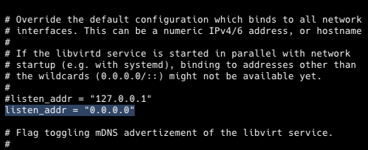

# Terraform for Unraid 

## Description

Deploy Unraid VMs with Terraform and OpenTofu 

Thanks to [chrisreeves](https://github.com/chrisreeves-/scripts/tree/master/terraform/unraid) for doing most of the work on this. This repo just expands on his work and attempts to make the process clearer and easier.

## Requirements

1. A libvirt provider - Unraid will be this for us
1. mkisofs - This is required on the device you are running Terraform and is used to create the image and located in the PATH. You can add this binary by running the shell script `sudo ./add_mkisofs.sh` in the proect root
2. Libvirt needs to be listening on 0.0.0.0 on the Unraid server. See "Change libvirt Listen Address" below
3. Terraform or OpenTofu (tested with OpenTofu v1.9.0)
4. An ssh key that you've authorized to login to your root account on unraid. This can be done by going on the unraid dashboard to Settings > Manage Access > next to User: 'root': > Manage > paste your public key into the "SSH authorized keys" section


## Change Libvirt Listen Address
1. Use your favorite command line editor to open `/etc/libvirt/libvirtd.conf` on the Unraid host
2. Search for `listen_addr = "127.0.0.1"`
3. Change to `listen_addr = "0.0.0.0"`




## Configuring variables

Clone this repo to your machine
```bash
git clone https://github.com/mcreekmore/unraid-terraform.git
cd unraid-terraform
```

In the `provider.tf` file and replace the following fields with yours:

- `root@unraid`: this should be an accessible ip/dns record that you can ssh into
- `/home/yourhomedir/.ssh/id_ed25519.pub`: change this to point to an ssh key that you have added

In the `terraform.tfvars` file is where you'll set all of your preferences and paths to things like the image you'd like to use, your username, size of the disk, route to your public key for ssh access, and even the routes to your unraids domains and isos share.

If you don't know what yours is, you can check by running `ip a` in your unraid terminal and look for the interface that provides you with your networks private IP

If your private IP looks like 192.168.1.XX then your subnet would be "192.168.1.0/24"

And that's it! We can now deploy a VM using Terraform/OpenTofu to your Unraid server! There's one last file we should look at though. Open the `user_data.yaml.tftpl` file. In here is a [cloudinit](https://cloudinit.readthedocs.io/en/latest/index.html) configuration file. This file runs once the vm is initialized and handles some provisioning for us.

If you'd like any programs installed by default you can add them in the `packages` section. Cloudinit is fairly powerful and an industry standard so look around their docs to see what all can be done with this.

## Running terraform

Once you've customized the variables to your liking, we can now run the project. This project should work with both Terraform and OpenTofu, so for the sake of this tutorial i will keep it agnostic and assume you have your preferred tool aliased to `t` in your terminal.

If you want to use Terraform just replace `t` with `terraform`, and for OpenTofu replace `t` with `tofu`

```bash
# initialize the project state
t init

# This will print a plan for what terraform/tofu plans to do
t plan

# Applies your configuration and builds the vm, type "yes" to confirm
t apply

# Or if you're tired of typing yes
t apply -auto-approve
```

Be patient, it may take a few minutes to initialize. Once the command has finished you should see a new VM in your unraid dashboard! You should be able to ssh into your vm passwordless with your ssh key, and then run `neofetch` and revel in the fruits of your labor.

You can undo your changes with:

```bash
t destroy
```

#### Note on Terraform/OpenTofu lifecycle management.

If you're new to the concept of Infrastrucrure as Code (IaC) and declarative infrastructure, the main thing to know is that all lifecycle management (i.e. changing, modifying, deleting) should be handled by terraform/tofu.

These tools keep track of everything they've done in a state file. If you're using this project we just simply are using a local state file `terraform.tfstate`. If the real state and this file get out of sync, terraform won't know what to do. 

And please do **NOT** commit this file to version control.

Thank you for taking a look at this project! If you're interested in tracking your terraform/tofu state files cheaply in an S3 bucket with [Backblaze](https://www.backblaze.com/), keep an eye out! I'm working on a follow up that will teach you just that.

And I'm also planning on expanding this project to also include steps on how to provision a kubernetes high-availability cluster using terraform and helm for your unraid server :)